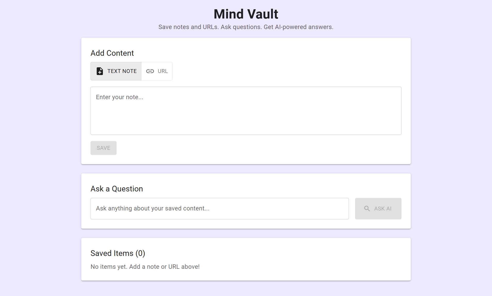

# Mind Vault (AI-powered RAG knowledge base)

**Mind Vault** is a powerful, self-hosted knowledge management system that leverages Retrieval-Augmented Generation (RAG) to help you store, organize, and query your information intelligently. Whether it's a deep-dive research paper, a blog post URL, or just a quick note, Mind Vault turns your static data into an interactive knowledge base.

**Screenshots**



**Screen recording of Mind Vault**
[Mind Vault Screen Recording](Mind_Vault_Screen_Recording.mp4)

---

## Key Features

-   **Ingestion**: Add content via direct URLs or raw text. The system automatically fetches, cleans, and processes web content.
-   **Chunking**: Transparently breaks down long documents into manageable, context-aware chunks for optimal retrieval.
-   **Semantic Search**: Uses vector embeddings via ChromaDB to find the most relevant information based on *meaning*, not just keywords.
-   **AI Insights**: Integrated with **Google Gemini (Flash Lite)** to provide concise, context accurate answers based *only* on your stored knowledge.
-   **Modern Dashboard**: A clean, intuitive interface built with React and Material UI, featuring real-time state management via Redux Toolkit.
-   **Source Tracking**: Every answer provided by the AI comes with linked sources, so you can always verify the information.

## Getting Started

### Prerequisites

-   **Python 3.9+**
-   **Node.js 18+**
-   **Google AI Studio API Key** (for Gemini)

### Backend Setup

1.  Navigate to the `backend` directory:
    ```bash
    cd backend
    ```
2.  Create and activate a virtual environment:
    ```bash
    python -m venv .venv
    .venv\Scripts\activate # IOS: source .venv/bin/activate
    ```
3.  Install dependencies:
    ```bash
    pip install -r requirements.txt
    ```
4.  Configure environment variables:
    Create a `.env` file in the `backend` folder:
    ```env
    GEMINI_API_KEY=your_api_key_here
    ```
5.  Launch the server:
    ```bash
    python main.py
    ```
    The API will be available at `http://localhost:8000`.

### Frontend Setup

1.  Navigate to the `frontend` directory:
    ```bash
    cd frontend
    ```
2.  Install dependencies:
    ```bash
    npm install
    ```
3.  Start the development server:
    ```bash
    npm start
    ```
    The dashboard will open at `http://localhost:3000`.

---

## Tech Stack

### Backend
-   **Framework**: [FastAPI](https://fastapi.tiangolo.com/)  
-   **Vector Database**: [ChromaDB](https://www.trychroma.com/)
-   **LLM & LLM Model**: [Google Gemini & gemini-flash-lite-latest](https://aistudio.google.com/)
-   **Scraping**: BeautifulSoup4 & Urllib
-   **Logging**: Custom structured logging for debugging ingestion pipelines

### Frontend
-   **Library**: [React 19](https://react.dev/)
-   **State Management**: [Redux Toolkit](https://redux-toolkit.js.org/)
-   **UI Components**: [Material UI (MUI)](https://mui.com/)
-   **Styling**: Emotion (CSS-in-JS)
-   **API Client**: Axios

---

# Mind Vault Backend

## API Endpoints

- `POST /api/ingest`: Submit a URL or text for processing and storage.
- `POST /api/query`: Ask a question based on stored knowledge.
- `GET /api/items`: List all ingested knowledge items.

## Core Components

- **ChromaDB**: Local vector database stored in `./chroma_storage`.
- **GenAI Client**: Integrated with Google Gemini Flash Lite for fast, accurate generation.
- **Services**:
  - `url_fetcher.py`: Web scraping logic.
  - `chunker.py`: Text segmentation logic.
  - `vector_store.py`: ChromaDB interaction layer.

---

# Mind Vault Frontend

## Features

- **Knowledge Ingestion**: Simple form to submit URLs or text blocks.
- **AI Chat Interface**: Interactive chat to query your stored knowledge with cited sources.
- **Status Monitoring**: Visual feedback for ingestion and query states.
- **State Management**: Uses Redux Toolkit for consistent data flow across components.

## Tech Stack

- **React 19**
- **Material UI v7**
- **Redux Toolkit**
- **Axios**

---

## Privacy & Local First

Data index (ChromaDB) is stored locally in the `backend/chroma_storage` directory. Only the specific context chunks required to answer a question are sent to the Gemini API.

---

